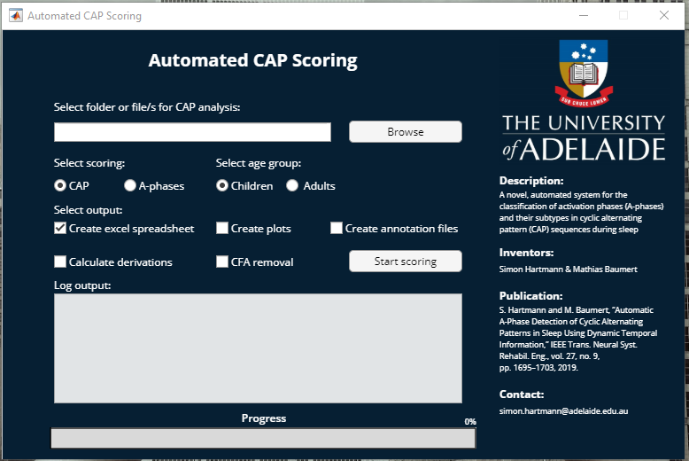

# CAPdetection-LSTM GUI

The GUI can be started by opening the *CAP_app_v1.mlapp* file in MATLAB and clicking on *Run* in the App Designer Start Page.

Following window will appear:

## Selecting folder or files for analysis

There are two options to select sleep recordings for the scoring analysis. On the one hand, it is possible to enter the folder name including all the files that need to be scored into the text field. The software will automatically select all edf and rec files in the folder and will add them to the queue of files that will be processed.

On the other hand, specific sleep recordings can be selected using the “Browse”-button. A file selector window  will appear enabling to select all the desired sleep recordings. Multiple selection is enabled using the appropriate shortcuts (usually Ctrl and Shift). It is not required to select the relevant annotation files. After selecting the desired sleep recordings, the selection is confirmed with the “Open”-button in the file selector. Afterwards the file path will appear in the text field. 

## Select scoring

The interface allows to select between two different scoring options: “CAP”-scoring or “A-phase”-scoring.
###CAP
The option “CAP”-scoring  will post-process the scoring results in agreement with the CAP atlas. A-phases or B-phases are restricted to 2–60 s by definition but the number of cycles per CAP sequence is not limited. In accordance with the CAP atlas, the time period between two CAP sequences is considered as non-CAP. The last A-phase prior to a non-CAP period is also defined as non-CAP as it does not form a cycle. As REM sleep includes mainly desynchronized A-phases located further apart than 60 s, CAP scoring is restricted to NREM sleep

###A-phases
The option “A-phase”-scoring will provide the raw output with no post-processing. The scoring contains all isolated and terminating A-phases in addition to the A-phases included in CAP-sequences.

## Select age group

Currently not implemented.

## Select scoring output

The interface allows to select up two three different scoring outputs.

### Excel spreadsheet

The option “Create excel spreadsheet” will create a Microsoft Excel worksheet that contains all the CAP measures for each selected recording. Following table lists all computed CAP measures and their meaning.

| Variables  | Description |
| ------------- | ------------- |
| ID  | subject's ID  |
| SLDUR  | total duration of NREM sleep in seconds  |
| NRAPH  | total number of A-phases  |
| APHDUR  | total duration of A-phases in seconds  |
| AVGAPHDUR  | average duration of A-phases in seconds  |
| NRAPHPH  | number of A-phases per hour of NREM sleep  |
| RAPHSL  | total duration of A-phases/total duration of NREM sleep  |
| NRA1  | total number of A1-phases  |
| NRA2  | total number of A2-phases  |
| NRA3  | total number of A3-phases  |
| A1DUR  | total duration of A1-phases in seconds  |
| A2DUR  | total duration of A2-phases in seconds  |
| A3DUR  | total duration of A3-phases in seconds  |
| AVGA1DUR  | average duration of A1-phases in seconds  |
| AVGA2DUR  | average duration of A2-phases in seconds  |
| AVGA3DUR  | average duration of A3-phases in seconds  |
| RA1APH  | total number of A1-phases/total number of A-phases  |
| RA2APH  | total number of A2-phases/total number of A-phases  |
| RA3APH  | total number of A3-phases/total number of A-phases  |
| RA1NRE  | total duration of A1-phases/total duration of NREM sleep  |
| RA2NRE  | total duration of A2-phases/total duration of NREM sleep  |
| RA3NRE  | total duration of A3-phases/total duration of NREM sleep  |
| A1IND  | A1 index (number of A1-phases per hour)  |
| A2IND  | A2 index (number of A2-phases per hour)  |
| A3IND  | A3 index (number of A3-phases per hour)  |
| NRCAP  | total number of CAP sequences  |
| CAPDUR  | total duration of CAP sequences in seconds  |
| RCAPSL  | CAP rate (percentage of NREM sleep occupied by CAP)  |
| AVGCAPDUR  | average duration of CAP sequences in seconds  |
| AVGCYCLEDUR  | average duration of CAP cycles in seconds  |
| AVGBPHADUR  | average duration of B-phases in seconds  |

### Plots

The option “Create plots” will create a pdf file containing three different plots for each selected recording. The plots include a time series plot of the EEG signal, a hypnogram plot containing the sleep stages and A-phases, as well as a time-frequency plot of the EEG signal.

### Annotation files

The option “Create annotation files” will create a textfile containing the scoring output for each selected recording. The annotation file includes the start time of the A-phase, the subtype of the A-phase, the duration of the A-phase, and potentially additional information about the event.

## CFA removal

In case the sleep recording file contains an ECG, it is possible to select the option to remove cardiac field artefacts (CFA). The label of the ECG channel must match one of the following labels: ECG, ECGL, EKG, ECG1ECG2, ECG1-ECG2, ECG1, ekg, ECG3ECG3, ECGLECGR, ECGRECGL, ECGECG, ecg, ECGR

## Calculated channel derivations

In case the sleep recording contains EEG channels referenced to ground or one identical reference electrode, the required derivations for CAP scoring have to be determined. In this case, the option “Calculate derivations” has to be selected. If the required channels are already available in the recording, this option is not needed.

## Scoring progress

After all settings were selected, the scoring is started by pressing the “Start scoring”-button. A new window will appear that allows the user to select the channels that should be included into the scoring (mostly C4-A1 and/or C3-A2). The required channels are added by selecting them and pressing the “Add”-button. Falsely added channels can be removed by selecting them in the “Selected channels” list followed by the “Remove”-button. The available channels are extracted from the the first recording that will be processed. The system requires all recordings to contain the same selected channels. In case, the “Calculate derivations”-option was selected, a different window appears that allows the user to select manually the derivations. After selecting the required channels or derivations, the scoring is started by confirming the selection with the ”OK”-button. The “Log output” will show additional information about the scoring progress. Moreover, the progress bar below the log output will show a constant update on the scoring progress. At the end of the scoring, a full scoring report is provided. The scoring report displays information about the number of files that were successfully scored, the number of files that could not be scored, the number of files that did not have a sleep staging annotation file, the number of files that did not contain the selected channels/derivations, the number of subjects that did not contain an ECG for CFA removal. The identifiers for each file that could not be scored are listed at the end of the scoring report.
